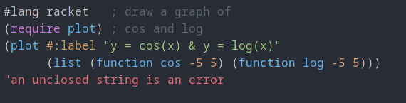

# One Dark Color Scheme for DrRacket

Atom's iconic One Dark color scheme for DrRacket!

## Installation

### Option 1: Package Catalog

```bash
raco pkg install drracket-one-dark
```

### Option 2: Directly from GitHub

```bash
raco pkg install https://github.com/JoaoBrlt/drracket-one-dark.git
```

### Option 3: Package Manager

1. Open DrRacket.

2. Navigate to the package installer.

`File` > `Install Package...`

3. Paste the package source.

`https://github.com/JoaoBrlt/drracket-one-dark.git`

4. Install the package.

5. Close the package installer.

## Usage

1. Restart DrRacket.

2. Navigate to the color schemes.

`Edit` > `Preferences` > `Colors` > `Color Schemes`

3. Select the One Dark color scheme.

## Preview

| Scheme   | Screenshot                                              |
|----------|---------------------------------------------------------|
| One Dark |   |

## License

This project is licensed under the GPLv3 License - see the [LICENSE.md](LICENSE.md) file for details.
